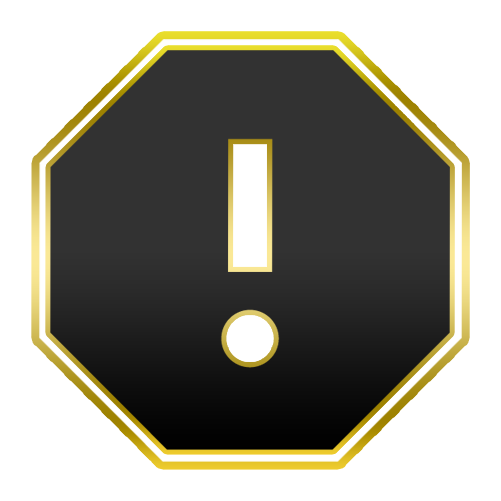

# THIS ADDON IS WORK IN PROGRESS AND CURRENTLY: NOT WORKING

  

<h1 align="center">ECL Report Addon</h1>

    
    
     
    
    
     
    
    
      

<h2 align="center">What is this?</h2>

[ECL](https://ecl.gg/) is a matchmaking organizer for Counter-Strike: Global Offensive.
Their games are hosted and managed by [Faceit](https://www.faceit.com/).
In order to report misbehaving players ECL made their own report tool.
Unfortunately a lot of information must be copied over, like a link to the match room, the link to the reported player
and so on.
This discourages players from reporting others and gives room for toxic players.
The goal of this extension is to offer a clean and fast way to report players and
making the ECL experience a bit better.

<h1 align="center">Install</h1>

Install the addon from the [Google Chrome Store][chrome] or [addons.mozilla.org][mozilla].

<h1 align="center">For users</h1>

Did you discover something strange or want to request a new feature?
PM me [on twitter](https://www.twitter.com/FoseFx) or write me an [email](mailto:info@fosefx.com) or even better: [open an issue](https://github.com/FoseFx/ECL-Report-Addon/issues/new).

  

<h1 id="for-developers" align="center">For Developers</h1>

If you want to contribute to this project make sure you read the [CODE OF CONDUCT](CODE_OF_CONDUCT.md) and are familiar with [How to contribute to open source](https://opensource.guide/how-to-contribute/#a-checklist-before-you-contribute). Read the [CONTRIBUTING.md](CONTRIBUTING.md).

## Building

0. Make sure you have npm installed
1. Clone this repo: `git clone git@github.com:FoseFx/ECL-Report-Addon.git`
2. Install Dependencies `npm run setup`
3. Build the extension for development using `npm run build:dev`
4. Build the extension for production using `npm run build:prod`
5. [Install the build](#install-build)

## Testing
In order to be merged your code must be tested.
This project uses the [jest](https://jestjs.io/) test runner.

Run `npm test` to run all tests and to generate a coverage report (open using `firefox coverage/lconv-report/index.html`)

Run `npm run e2e[:nobuild]` to run all End to End tests.
This requires docker to be installed and `firefox` and `google-chrome` to exist in yor path.
Because we cant run chrome in headless mode a display is needed.

If you dont have a display connected install `Xvfb` and run `npm run e2e:nox` or `npm run e2e:nobuild-nox`.

## Linting
Code style and readability is important! Use `npm run lint` to check if your code is compliant, if not try `npm run lint:fix` and/or manually fix it.

## Install build

### Firefox

1. Navigate to `about:addons`.
2. Click on the wheel
3. Click `debug addon`
4. Click `load temporary addon`

### Chrome

1. Navigate to `chrome://extensions/`.
2. Activate `developer mode` in the upper right corner
3. Click `load unpacked`

  

[gh-release]: about:blank
[mozilla]: about:blank
[chrome]: about:blank

